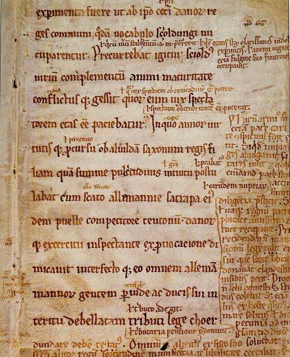
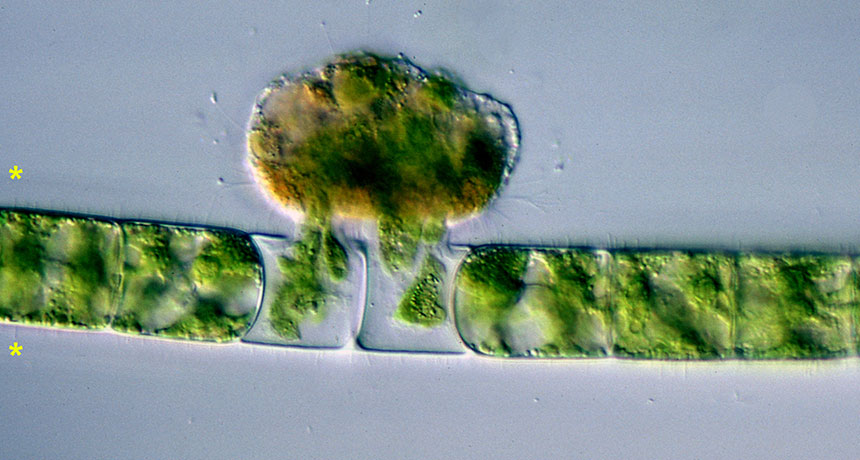

```{r setup, include=FALSE, cache=FALSE}
options(htmltools.dir.version = FALSE, width=80)
knitr::opts_chunk$set(warning = FALSE, message = FALSE, cache=TRUE)

## from http://yihui.name/knitr/hooks#chunk_hooks
knitr::knit_hooks$set(small.mar=function(before, options, envir) {
                                              if (before) par(mar=c(4, 5, 1, 1)) ## smaller margin on top and right
})
```

class: title-slide, middle, center

# Markup languages and reproducibility

## Robert Castelo
[robert.castelo@upf.edu](mailto:robert.castelo@upf.edu)
### Dept. of Medicine and Life Sciences
### Universitat Pompeu Fabra

<br>

## Fundamentals of Computational Biology
### BSc in Biomedical Sciences
### UPF School of Medicine and Life Sciences
### Academic Year 2025-2026


---
class: center, middle, inverse

# Markup languages

---

## Markup languages

.left-column[
&nbsp;&nbsp;  
* Marking up paper manuscripts was a common and time-consuming
editorial task prior digital publishing.  
&nbsp;&nbsp;
* The goal of marking up was not only to correct spelling or
punctuation but also to shape content such as highlighting using boldface.  
&nbsp;&nbsp;
* Marking up manuscripts still occurs today, but the editorial process
is entirely digital.
]

.right-column[


.footer[
Image of a manuscript at the Royal Library of Copenhagen taken from
[Wikipedia](https://en.wikipedia.org/wiki/Gloss_%28annotation%29)
]

]

---

## Markup languages

* In computer science, a
[markup language](https://en.wikipedia.org/wiki/Markup_language)
is an additional syntax woven through text to give format and/or additional
semantics.  
&nbsp;&nbsp;
* The result of processing text with embedded markup formatting instructions is
that text with the given format, but without showing the markup instructions.  
&nbsp;&nbsp;
* The first markup language known as such was the
[standard generalized markup language (SGML)](https://en.wikipedia.org/wiki/Standard_Generalized_Markup_Language)
developed in 1974 by the researcher
[Charles Goldfarb](https://en.wikipedia.org/wiki/Charles_Goldfarb) at IBM.  
&nbsp;&nbsp;
* SGML was the predecessor of the
[hypertext markup language (HTML)](https://en.wikipedia.org/wiki/HTML), which
is the standard language for documents that can be opened using a web browser.  
&nbsp;&nbsp;
* HTML was invented by
[Tim Berners-Lee](https://en.wikipedia.org/wiki/Tim_Berners-Lee), who also
developed the first web browser and web server and for these achievements he
is considered as the _inventor_ of the
[world wide web (WWW)](https://en.wikipedia.org/wiki/World_Wide_Web).  
&nbsp;&nbsp;
* [Markdown](https://en.wikipedia.org/wiki/Markdown) is a _lightweight_ markup
language created in 2004 by
[John Gruber](https://en.wikipedia.org/wiki/John_Gruber) and
[Aaron Swartz](https://en.wikipedia.org/wiki/Aaron_Swartz) to transform
easy-to-read plain text into HTML.


---

## HTML

* An HTML document is a text file with filename extension `.html`
  with so-called [HTML elements](https://en.wikipedia.org/wiki/HTML_element)
  that tell a web browser how to display the text.  
  &nbsp;&nbsp;
* HTML elements provide information on whether a specific piece text
  is a heading, or a paragraph, or a link, etc.  
  &nbsp;&nbsp;
* Typically, HTML elements are defined by a start and an end tag and the content
  in between affected by those tags.
  <pre>
  &lt;tagname&gt;Some content&lt;/tagname&gt;
  </pre>
* Some HTML elements, called _empty elements_, have no associated content
  and have no end tag, such as for instance the `<br>` (line break) tag.  
  &nbsp;&nbsp;
* Examples of boldface, italics and empty HTML elements:
.left-column[
  <pre>
  &lt;b&gt;This text is in boldface&lt;/b&gt;
  &lt;i&gt;This text is in italics&lt;/i&gt;
  This line is&lt;br&gt;broken.
  </pre>
]
.right-column[
<p style="margin-top: 0px">
&nbsp;&nbsp;&nbsp;&nbsp;&nbsp;&nbsp;&nbsp;**This text is in boldface**
<br>
&nbsp;&nbsp;&nbsp;&nbsp;&nbsp;&nbsp;&nbsp;*This text is in italics*
<br>
&nbsp;&nbsp;&nbsp;&nbsp;&nbsp;&nbsp;&nbsp;This line is<br>&nbsp;&nbsp;&nbsp;&nbsp;&nbsp;&nbsp;&nbsp;broken.
]


---

## HTML

* Example of a simple HTML document. The image tag `` is empty but has
attributes.

.left-column[

<pre>
&lt;h1&gt;Creepy biology&lt;/h1&gt;  
&nbsp;&nbsp;
&lt;p&gt;
&lt;b&gt;&lt;i&gt;Vampyrella&lt;/i&gt;&lt;/b&gt; is an  
amoebae with a particular  
feeding behaviour of perforating  
the cell wall of algal cells and  
drawing out the contents for  
nourishment.
&lt;/p&gt;

&lt;img src="vampyrella.jpg"&gt;
</pre>
]
.right-column[
<h3 style="font-family:arial; font-weight:bold; color:black; margin-top:-10px; margin-left:25px">Creepy biology</h3>

<p style="font-size:100%; margin-top:-20px; margin-left:30px">
<i><b>Vampyrella</b></i> is an amoebae with a particular feeding behaviour
of perforating the cell wall of algal cells and drawing out the contents for
nourishment.
<br><br>


</p>
]

.footer[
Image and text taken from
[Wikipedia](https://en.wikipedia.org/wiki/Vampyrella)
]


---

## HTML

* Other common HTML elements are also those for creating hyperlinks (`<a>`), and
  ordered (`<ol>`) and unordered (`<ul>`) lists of items (`<li>`).

.left-column[
<pre>
&lt;p&gt;
List of some
&lt;a href="https://en.wikipedia.org/wiki/Vampyrella">Vampyrella&lt;/a&gt;
species:
&lt;/p&gt;

&lt;ul&gt;
  &lt;li&gt;Vampyrella closterii.
  &lt;li&gt;Vampyrella incolor.
  &lt;li&gt;Vampyrella inermis.
  &lt;li&gt;Vampyrella latertia.
&lt;/ul&gt;
</pre>
]
.right-column[

<p style="margin-left:10px; margin-top:150px">
List of some <a href="https://en.wikipedia.org/wiki/Vampyrella">Vampyrella</a> species:
</p>

<ul style="margin-left:10px">
  <li>Vampyrella closterii.
  <li>Vampyrella incolor.
  <li>Vampyrella inermis.
  <li>Vampyrella latertia.
</ul>
]


---

## Markdown

* A Markdown document is a text file with filename extension `.md` where you
  write text in a simple way with a few elements of essential formatting syntax.  
  &nbsp;&nbsp;
* Markdown syntax elements are readable as you write them and, at the same
  time, Markdown processor software use them to provide format by converting
  the source Markdown `.md` file into an HTML or PDF file.  
  &nbsp;&nbsp;
* The [2004 original Markdown](https://daringfireball.net/projects/markdown)
  specification by Gruber and Swartz had some ambiguities.  
  &nbsp;&nbsp;
* To avoid a Markdown document rendering differently with different Markdown
  processors, a group of developers introduced a standard, unambiguous syntax
  specification for Markdown called [CommonMark](https://commonmark.org), which
  is widely used, for instance at [GitHub](https://github.com) or
  [StackOverflow](https://stackoverflow.com).

---
class: small-table

## Markdown

* Some Markdown formatting elements. See [here](https://commonmark.org/help) for a full specification.

<table style="width: 100%;">
  <thead>
    <tr>
      <th>Source text</th>
      <th>Alternative</th>
      <th>Result</th>
    </tr>
  </thead>
  <tbody>
    <tr>
      <td><pre>*Italic*</pre></td>
      <td><pre>_Italic_</pre></td>
      <td><i>Italic</i></td>
    </tr>
    <tr>
      <td><pre>**Bold**</pre></td>
      <td><pre>__Bold__</pre></td>
      <td><font style="font-weight: bold">Bold</font></td>
    </tr>
    <tr>
      <td><pre># Heading 1</pre></td>
      <td><pre>Heading 1<br>=========</pre></td>
      <td><h5 style="font-family:arial; color:black; margin-top:-2px">Heading 1</h5></td>
    </tr>
    <tr>
      <td><pre>## Heading 2</pre></td>
      <td><pre>Heading 2<br>---------</pre></td>
      <td><h6 style="font-family:arial; color:black; margin-top:-2px">Heading 2</h6></td>
    </tr>
    <tr>
      <td><pre>* Item 1<br>* Item 2<br>* Item 3</pre></td>
      <td><pre>- Item 1<br>- Item 2<br>- Item 3</pre></td>
      <td><ul><li>Item 1<li>Item 2<li>Item 3</ul></td>
    </tr>
    <tr>
      <td><pre>[Link](https://www.example.com)</pre></td>
      <td><pre>[Link][1]<br>&#8942;<br>[1]: https://www.example.com</pre></td>
      <td><a href="https://www.example.com">Link</a></td>
  </tbody>
</table>

---

## Markdown

* Paragraphs in Markdown are created by introducing one or more blank lines.  
  &nbsp;&nbsp;
* Previous HTML example revisited with Markdown.

.left-column[

<pre>
# Creepy biology  
&nbsp;&nbsp;
***Vampyrella*** is an amoebae  
with a particular feeding  
behaviour of perforating the  
cell wall of algal cells and  
drawing out the contents for  
nourishment.

&#x21;[](vampyrella.jpg)
</pre>
]
.right-column[
<h3 style="font-family:arial; font-weight:bold; color:black; margin-top:-10px; margin-left:25px">Creepy biology</h3>

<p style="font-size:100%; margin-top:-20px; margin-left:30px">
<i><b>Vampyrella</b></i> is an amoebae with a particular feeding behaviour
of perforating the cell wall of algal cells and drawing out the contents for
nourishment.
<br><br>


</p>
]

.footer[
Image and text taken from
[Wikipedia](https://en.wikipedia.org/wiki/Vampyrella)
]


---

## Markdown

* There are Markdown text editors running through the web browser such as
  [StackEdit](https://stackedit.io),
  [Dillinger](https://dillinger.io) or
  [Markdown Editor](https://jbt.github.io/markdown-editor), and as
  standalone software such as
  [typora](https://typora.io).  
  &nbsp;&nbsp;
* Some platforms may render formatted Markdown text, such as
  [GitHub README.md files](https://docs.github.com/en/repositories/managing-your-repositorys-settings-and-features/customizing-your-repository/about-readmes) or
  [Stackoverflow posts](https://stackoverflow.com/editing-help).  
  &nbsp;&nbsp;
* Markdown can be also used to elaborate documents that mix text and code
  in what is known as
  [literate programming](https://en.wikipedia.org/wiki/Literate_programming).


---

## YAML

* [YAML](https://en.wikipedia.org/wiki/YAML) is the recursive acronym for
"YAML ain't markup language" and a syntax for specifying pairs of keyword-value
typically used to store data and to provide configuration files (`.yml`) or
headers in Markdown documents.  
&nbsp;&nbsp;
* YAML serves a similar purpose than the
[extensible markup language (XML)](https://en.wikipedia.org/wiki/XML) but with
a lighter syntax; find [here](https://yaml.org/spec) its official specification.

.left-column[

<p style="text-align:center"><b>XML</b></p>

.font14px[

```<Organisms>```<br>
&nbsp;&nbsp;&nbsp;```<organism>```<br>
&nbsp;&nbsp;&nbsp;&nbsp;&nbsp;&nbsp;```<phylum>Cercozoa</phylum>```<br>
&nbsp;&nbsp;&nbsp;&nbsp;&nbsp;&nbsp;```<class>Proteomysidae</class>```<br>
&nbsp;&nbsp;&nbsp;&nbsp;&nbsp;&nbsp;```<order>Aconchulinida</order>```<br>
&nbsp;&nbsp;&nbsp;&nbsp;&nbsp;&nbsp;```<family>Vampyrellidae</family>```<br>
&nbsp;&nbsp;&nbsp;&nbsp;&nbsp;&nbsp;```<genus>Vampyrella</genus>```<br>
&nbsp;&nbsp;&nbsp;```</organism>```<br>
```</Organisms>```<br>

]

]

.right-column[

<p style="text-align:center"><b>YAML</b></p>

<pre style="margin-left:30px">
Organisms:
  - phylum: Cercozoa
    class: Proteomysidae
    order: Aconchulinida
    family: Vampyrellidae
    genus: Vampyrella
</pre>
]

---

## Concluding remarks

* Markup languages such as HTML and Markdown enable formatting of plain text.  
  &nbsp;&nbsp;
* Because Markdown is converted into HTML, you can also mix Markdown with HTML
  elements for a fine-grained control of the formatting.  
  &nbsp;&nbsp;
* The [look and feel](https://en.wikipedia.org/wiki/Look_and_feel) of HTML
  elements can be changed using
  [cascading style sheets (CSS)](https://en.wikipedia.org/wiki/CSS), which
  is a language with declarative statements specified along with the HTML
  document (e.g., `<p style="font-family: arial;">`).  
  &nbsp;&nbsp;
* HTML is interpreted in the same way across different web browsers because they
  all follow the conventions established by the
  [World Wide Web Consortium (W3C)](https://www.w3.org).  
  &nbsp;&nbsp;
* Many markup languages exist (see this
  [list](https://en.wikipedia.org/wiki/List_of_markup_languages)) and are used
  for a variety of purposes other than formatting (e.g., the
  [systems biology markup language -SBML](https://en.wikipedia.org/wiki/SBML)).  
  &nbsp;&nbsp;
* There are lots of free online training material for learning HTML (e.g.,
  [here](https://www.w3schools.com/html)) and Markdown (e.g.,
  [here](https://www.markdowntutorial.com)).

---
class: center, middle, inverse

# Reproducibility and literate programming

---

## Reproducibility

.left-column[

* Scientific discoveries never arise from the thin air, they are always built upon
previous scientific knowledge.  
&nbsp;&nbsp;
* Scientific knowledge is based on the premise that scientifically proven
facts or theories can be [reproduced](https://en.wikipedia.org/wiki/Reproducibility)
(observed or verified again and again).


]

.right-column[


]

.footer[
Left image from [ScienceNews](https://www.sciencenews.org/article/redoing-scientific-research-best-way-find-truth), right image from [xkcd](https://xkcd.com/242).
]

---

## Reproducibility

.left-column[

* In research involving computational means (data and software)
reproducing a result can be also challenging.


]

--

.right-column[
<p style="margin-top: -20px">
* It should be, however, always feasible!
  [(Claerbout and Karrenbach, 1992)](https://library.seg.org/doi/abs/10.1190/1.1822162).  
  &nbsp;&nbsp;
* Within the reproducibility spectrum, scientific and industry standards are
  evolving to increase the level of reproducibility.


]

.footer[
Left image from [(Kim et al., 2018)](https://dx.doi.org/10.1093%2Fgigascience%2Fgiy077),
right image from [(Peng et al., 2011)](https://dx.doi.org/10.1126/science.1213847).
]

---

## Literate programming

* [Literate programming (LP)](https://en.wikipedia.org/wiki/Literate_programming)
  is a paradigm in which programming statements are interspersed with
  documentation.  
  &nbsp;&nbsp;
* LP was introduced by [Donald Knuth](https://en.wikipedia.org/wiki/Donald_Knuth)
  in 1984, developing the so-called
  [WEB System](https://en.wikipedia.org/wiki/Web_%28programming_system%29).


* An LP tool produces two files: the _tangled_ source code of the computer
  program and the whole document, including the text _woven_ with the code,
  formatted for displaying or printing.

---

## Literate programming

* There are many LP tools for different programming languages. Some of them are:

|  Name   | Programming language | Result |
|---------|----------------------|--------|
| WEB     | Pascal               | PDF    |
| CWEB    | C and C++            | PDF    |
| NoWEB   | any                  | PDF    |
| Sweave  | R                    | PDF    |
| Jupyter Notebook | Python      | HTML   |
| R Markdown | R                 | HTML   |

* Currently, [Jupyter Notebooks](https://jupyter.org) and
  [R Markdown](https://rmarkdown.rstudio.com) are two most widely used
  LP tools for doing reproducible analyses on the computer.  
  &nbsp;&nbsp;
* The rest of this presentation will briefly introduce R Markdown, but
  the R Markdown
  [website by RStudio](https://rmarkdown.rstudio.com) contains very good
  learning materials on how to get started and how to use most of its features.


---

## R Markdown

* An R Markdown document starts with a [YAML](https://en.wikipedia.org/wiki/YAML) header:
<pre>
&#45;&#45;&#45;
title: Report on this and that
subtitle: FCB 2026
author: Me
date: February 17th, 2026
output: html_document
&#45;&#45;&#45;
</pre>

---

## R Markdown

* The YAML header allows one to make global formatting choices:
<pre>
&#45;&#45;&#45;
title: Report on this and that
subtitle: FCB 2026
author: Me
date: February 17th, 2026
output:
&nbsp;&nbsp;&nbsp;&nbsp;html_document:
&nbsp;&nbsp;&nbsp;&nbsp;&nbsp;&nbsp;&nbsp;&nbsp;toc: true
&nbsp;&nbsp;&nbsp;&nbsp;&nbsp;&nbsp;&nbsp;&nbsp;toc_float: true
&#45;&#45;&#45;
</pre>

---

## R Markdown

* The rest of the R Markdown document is Markdown text with R code specified as
  follows:
````
```{r}`r ''`
dat <- read.csv("mydata.csv")
```
````
* Here the `r` letter refers to the fact that the **code chunk** contains R
  code.  
  &nbsp;&nbsp;
* Code chunks may have options to control how it is processed by the R Markdown
  engine. For instance, `eval` controls whether the code chunk should be executed:
````
```{r, eval=FALSE}`r ''`
dat <- read.csv("mydata.csv")
```
````
* The code chunk option `echo` can hide the source R code from the output.
````
```{r, echo=FALSE}`r ''`
dat <- read.csv("mydata.csv")
```
````


---

## R Markdown

* The code chunk option `results` can be used to hide the text output from
  the code chunk in the processed R Markdown output.
````
```{r, results="hide"}`r ''`
head(dat) ## output from this line will not be seen
```
````
* When displaying graphics, options `fig.width`, `fig.height`, `out.width`,
  `out.height`, `dpi`, `fig.align` and `fig.cap` allow one to control the
  aspect ratio, output size, resolution, alignment and caption text,
  respectively.
````
```{r, fig.height=5, out.height="300px", dpi=100, fig.align="center", fig.cap="In this figure we show axis y as function of axis x."}`r ''`
plot(dat$x, dat$y)
```
````


---
class: small-table

## R Markdown

* Including tables of results can be done storing them as `data.frame` objects
  and using the function `kable()` from the package
  [knitr](https://cran.r-project.org/package=knitr) and the code chunk
  option `results="asis"`.  
.left-column[
<pre>
&#x60;&#x60;&#x60;{r, echo=FALSE,
results="asis"}`r ''`
library(knitr)
kable(head(iris[, 1:3]),
      caption="Iris data.")
&#x60;&#x60;&#x60;
</pre>
]
.right-column[

```{r, echo=FALSE, results="asis"}
cat('<p style="margin-top:-35px">')
library(knitr)
kable(head(iris[, 1:3]), caption="Iris data.")
```
]

* The list of all available options can be found
  [here](https://yihui.org/knitr/options).


---

## R Markdown

* Example of an R Markdown document converted into HTML and displayed
on the browser (default sample R Markdown document in RStudio).

.left-column[


]

.right-column[


]

---

## Concluding remarks

* The lack of reproducibility of results hampers the advancement of science.  
  &nbsp;&nbsp;
* Reproducibility in data analysis is a minimum standard towards the end goal
  of full replicability.  
  &nbsp;&nbsp;
* There is a rich software toolkit for reproducible research: literate
  programming version control systems, data and code repositories, unit testing,
  containerization, etc.  
  &nbsp;&nbsp;
* There is an increasing demand for scientists and professionals with
  computational skills for reproducible data analysis.

--


