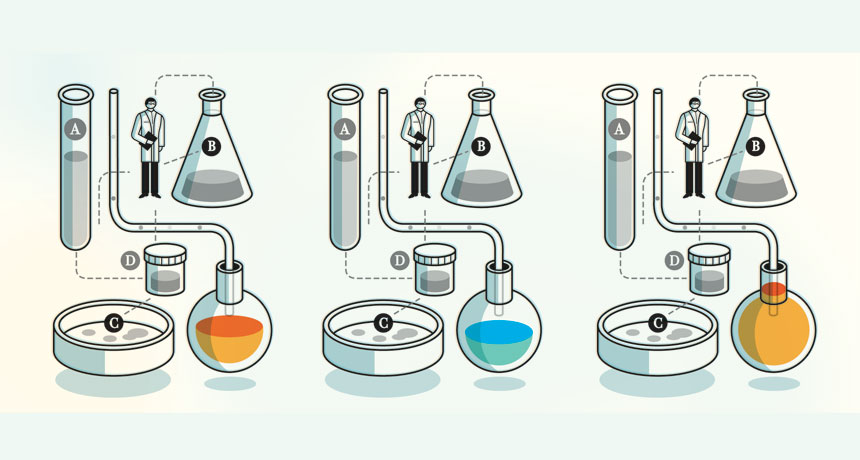
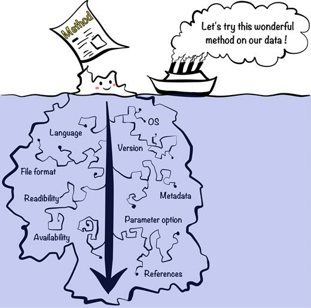
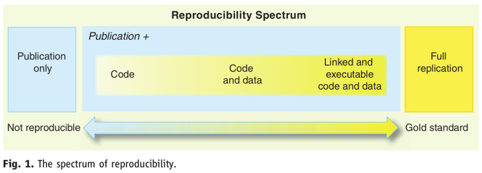
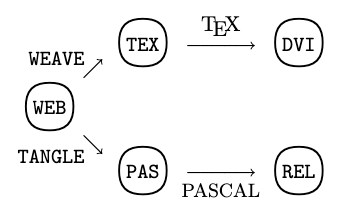
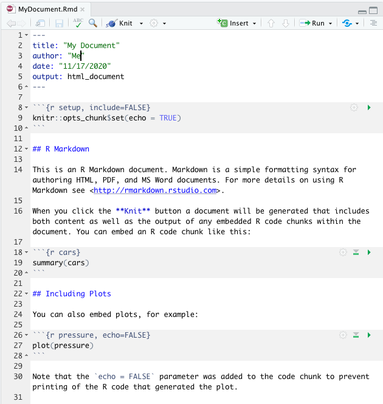
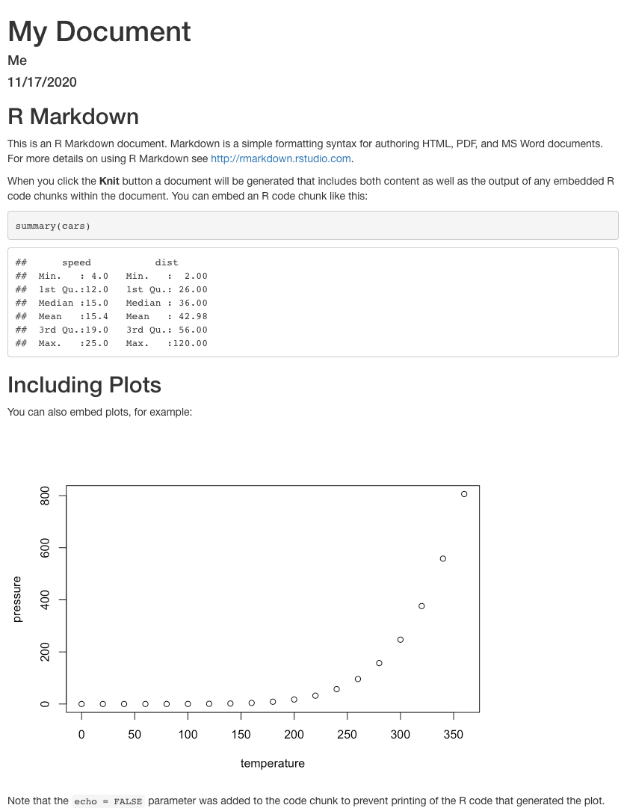
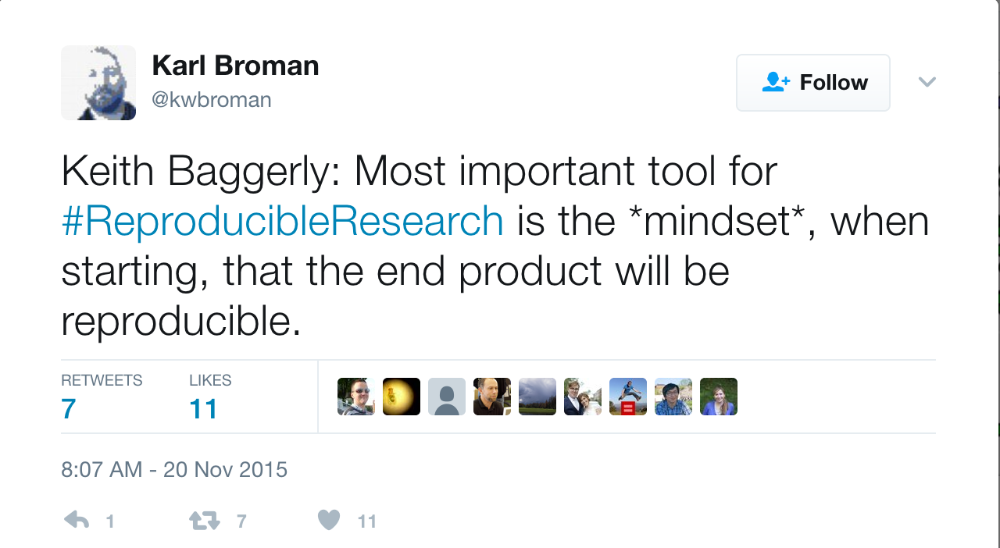

```{r setup, include=FALSE, cache=FALSE}
options(htmltools.dir.version = FALSE, width=80)
knitr::opts_chunk$set(warning = FALSE, message = FALSE, cache=TRUE)

## from http://yihui.name/knitr/hooks#chunk_hooks
knitr::knit_hooks$set(small.mar=function(before, options, envir) {
                                              if (before) par(mar=c(4, 5, 1, 1)) ## smaller margin on top and right
})
```

class: title-slide, middle, center

# Reproducibility with <br>literate programming

## Robert Castelo
[robert.castelo@upf.edu](mailto:robert.castelo@upf.edu)
### Dept. of Experimental and Health Sciences
### Universitat Pompeu Fabra

<br>

## Fundamentals of Computational Biology
### BSc on Human Biology
### UPF School of Health and Life Sciences
### Academic Year 2021-2022

---

## Reproducibility

.left-column[

* Scientific discoveries never arise from the thin air, they are always built upon
previous scientific knowledge.  
&nbsp;&nbsp;
* Scientific knowledge is based on the premise that scientifically proven
facts or theories can be [reproduced](https://en.wikipedia.org/wiki/Reproducibility)
(observed or verified again and again).



]

.right-column[


]

.footer[
Left image from [ScienceNews](https://www.sciencenews.org/article/redoing-scientific-research-best-way-find-truth), right image from [xkcd](https://xkcd.com/242).
]

---

## Reproducibility

.left-column[

* In research involving computational means (data and software)
reproducing a result can be also challenging.



]

--

.right-column[

* It should be, however, always feasible!
  [(Claerbout and Karrenbach, 1992)](https://library.seg.org/doi/abs/10.1190/1.1822162).  
  &nbsp;&nbsp;
* Within the reproducibility spectrum, scientific and industry standards are
  evolving to increase the level of reproducibility.



]

.footer[
Left image from [(Kim et al., 2018)](https://dx.doi.org/10.1093%2Fgigascience%2Fgiy077),
right image from [(Peng et al., 2011)](https://dx.doi.org/10.1126/science.1213847).
]

---

## Literate programming

* [Literate programming (LP)](https://en.wikipedia.org/wiki/Literate_programming)
  is a paradigm in which programming statements are interspersed with
  documentation.  
  &nbsp;&nbsp;
* LP was introduced by [Donald Knuth](https://en.wikipedia.org/wiki/Donald_Knuth)
  in 1984, developing the so-called
  [WEB System](https://en.wikipedia.org/wiki/Web_%28programming_system%29).



* An LP tool produces two files: the _tangled_ source code of the computer
  program and the whole document, including the text _woven_ with the code,
  formatted for displaying or printing.

---

## Literate programming

* There are many LP tools for different programming languages. Some of them are:

|  Name   | Programming language | Result |
|---------|----------------------|--------|
| WEB     | Pascal               | PDF    |
| CWEB    | C and C++            | PDF    |
| NoWEB   | any                  | PDF    |
| Sweave  | R                    | PDF    |
| Jupyter Notebook | Python      | HTML   |
| R Markdown | R                 | HTML   |

* Currently, [Jupyter Notebooks](https://jupyter.org) and
  [R Markdown](https://rmarkdown.rstudio.com) are two most widely used
  LP tools for doing reproducible analyses on the computer.  
  &nbsp;&nbsp;
* The rest of this presentation will briefly introduce R Markdown, but
  the R Markdown
  [website by RStudio](https://rmarkdown.rstudio.com) contains very good
  learning materials on how to get started and use most of its features.


---

## R Markdown

* An R Markdown document starts with a [YAML](https://en.wikipedia.org/wiki/YAML) header:
<pre>
&#45;&#45;&#45;
title: My document
author: Me
output: html_document
&#45;&#45;&#45;
</pre>
* The YAML header allows one to make global formatting choices:
<pre>
&#45;&#45;&#45;
title: My document
author: Me
output:
&nbsp;&nbsp;&nbsp;&nbsp;html_document:
&nbsp;&nbsp;&nbsp;&nbsp;&nbsp;&nbsp;&nbsp;&nbsp;toc: true
&nbsp;&nbsp;&nbsp;&nbsp;&nbsp;&nbsp;&nbsp;&nbsp;toc_float: true
&#45;&#45;&#45;
</pre>

---

## R Markdown

* The rest of the R Markdown document is Markdown text with R code specified as
  follows:
````
```{r}`r ''`
dat <- read.csv("mydata.csv")
```
````
* Here the `r` letter refers to the fact that the **code chunk** contains R
  code.  
  &nbsp;&nbsp;
* Code chunks may have options to control how it is processed by the R Markdown
  engine. For instance, `eval` controls whether the code chunk should be executed:
````
```{r, eval=FALSE}`r ''`
dat <- read.csv("mydata.csv")
```
````
* The code chunk option `echo` can hide the source R code from the output.
````
```{r, echo=FALSE}`r ''`
dat <- read.csv("mydata.csv")
```
````


---

## R Markdown

* The code chunk option `results` can be used to hide the text output from
  the code chunk in the processed R Markdown output.
````
```{r, results="hide"}`r ''`
head(dat) ## output from this line will not be seen
```
````
* When displaying graphics, options `fig.width`, `fig.height`, `out.width`,
  `out.height`, `dpi`, `fig.align` and `fig.cap` allow one to control the
  image size, aspect ratio, resolution, alignment and caption text, respectively.
````
```{r, fig.height=5, out.height="300px", dpi=100, fig.align="center", fig.cap="In this figure we show axis y as function of axis x."}`r ''`
plot(dat$x, dat$y)
```
````


---
class: small-table

## R Markdown

* Including tables of results can be done storing them as `data.frame` objects
  and using the function `kable()` from the package
  [knitr](https://cran.r-project.org/package=knitr) and the code chunk
  option `results="asis"`.  
.left-column[
<pre>
&#x60;&#x60;&#x60;{r, echo=FALSE,
results="asis"}`r ''`
library(knitr)
kable(head(iris[, 1:3]),
      caption="Iris data.")
&#x60;&#x60;&#x60;
</pre>
]
.right-column[

```{r, echo=FALSE, results="asis"}
cat('<p style="margin-top:-35px">')
library(knitr)
kable(head(iris[, 1:3]), caption="Iris data.")
```
]

* The list and explanations on all available options can be found
  [here](https://bookdown.org/yihui/rmarkdown-cookbook/chunk-options.html).


---

## R Markdown

* Example of an R Markdown document converted into HTML and displayed
on the browser (default sample R Markdown document in RStudio).

.left-column[



]

.right-column[



]

---

## Concluding remarks

* The lack of reproducibility of results hampers the advancement of science.  
  &nbsp;&nbsp;
* Reproducibility in data analysis is a minimum standard towards the end goal
  of full replicability.  
  &nbsp;&nbsp;
* There is a rich software toolkit for reproducible research: literate
  programming version control systems, data and code repositories, unit testing,
  containerization, etc.  
  &nbsp;&nbsp;
* There is an increasing demand for scientists and professionals with
  computational skills for reproducible data analysis.

--


